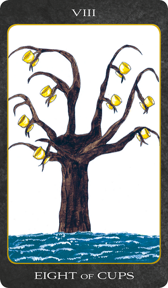

<h1 align="center">Tarot of the Day</h1>
  

  

The card speaks for itself on the surface, but other readings are entirely antithetical--giving joy, mildness, timidity, honour, modesty. In practice, it is usually found that the card shews the decline of a matter, or that a matter which has been thought to be important is really of slight consequence--either for good or evil.

