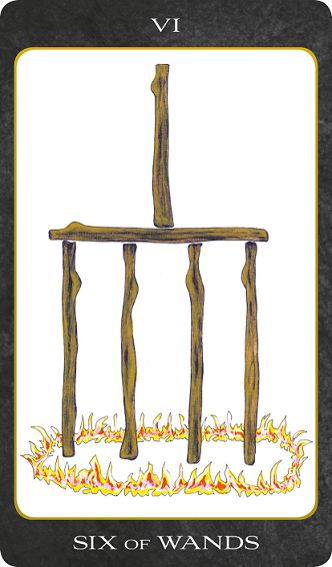

<h1 align="center">Tarot of the Day</h1>
  

  

The card has been so designed that it can cover several significations; on the surface, it is a victor triumphing, but it is also great news, such as might be carried in state by the King's courier; it is expectation crowned with its own desire, the crown of hope, and so forth.
