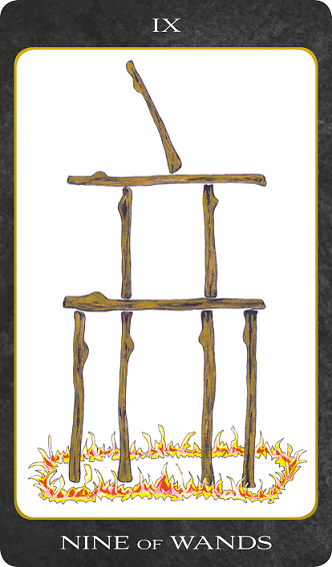

<h1 align="center">Tarot of the Day</h1>
  

  

The card signifies strength in opposition. If attacked, the person will meet an onslaught boldly; and his build shews, that he may prove a formidable antagonist. With this main significance there are all its possible adjuncts--delay, suspension, adjournment.

